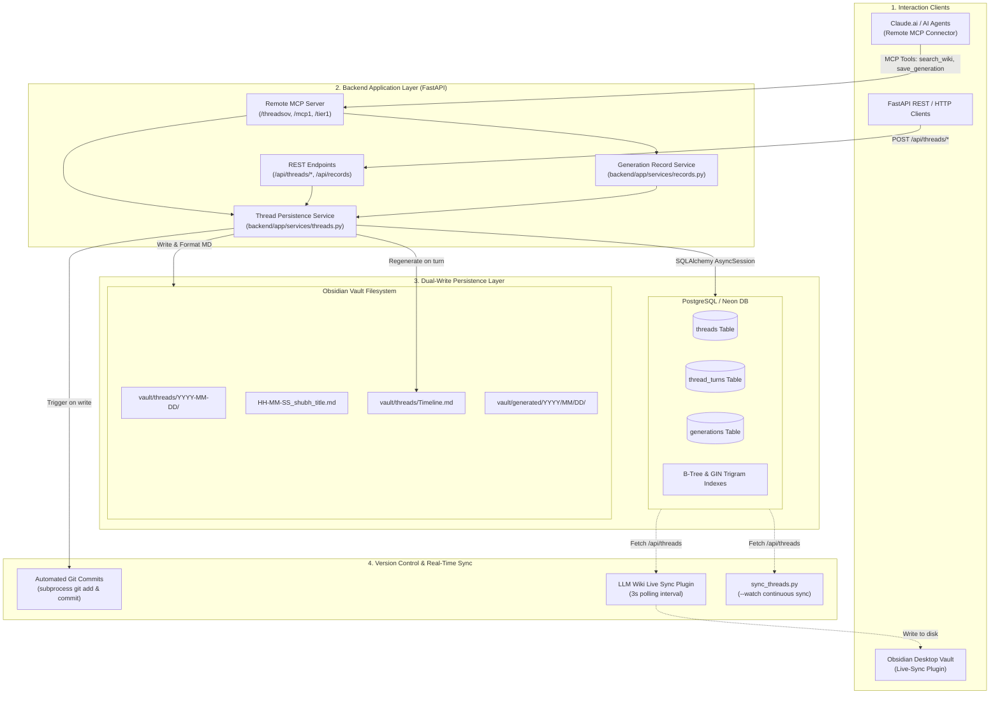
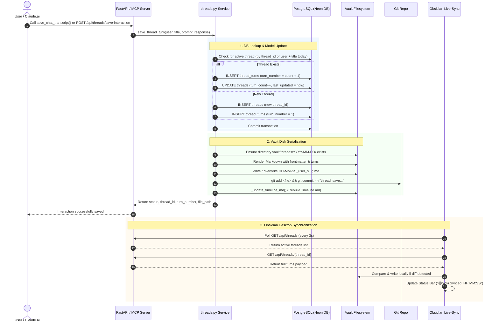

# Architecture Document: Thread Vault DB Implementation

> **System Name:** Thread Vault DB (Universal Second-Brain & Conversation Persistence Engine)  
> **Repository:** `LLM-Wiki-kar` / `AskCruz Knowledge Base`  
> **Author:** Shubh  
> **Document Version:** 1.0.0  
> **Date:** September 2026  

---

## 1. Executive Summary & Vision

The **Thread Vault DB** is a high-availability, multi-tier conversation persistence and synchronization engine designed to bridge conversational AI interactions (Claude.ai / AskCruz / LLM agents) with a local-first **Obsidian knowledge vault** and a cloud-native **PostgreSQL database (Neon / Render)**.

### Core Architectural Goals
1. **Zero-Friction Dual-Write:** Every interaction turn is captured synchronously in two distinct storage mediums:
   - Structured human-readable Markdown files in an Obsidian vault (`vault/threads/YYYY-MM-DD/HH-MM-SS_<user>_<slug>.md`).
   - Relational, indexed tables in PostgreSQL (`threads` and `thread_turns`).
2. **Local-First & Cloud-Synchronized:** Operates seamlessly across local developer environments and cloud deployments, with automated live sync to Obsidian desktop clients via a custom Obsidian plugin (`llm-wiki-live-sync`).
3. **Ascending Chronological Auditability:** All interactions are indexed in real time into `vault/threads/Timeline.md` with deep wikilinks, prompt previews, and turn counts.
4. **Git-Backed Durability:** Every disk write triggers automated Git staging (`git add`) and atomic commits (`git commit`) to ensure non-repudiable version history.
5. **AI Protocol Interoperability:** Implements the Model Context Protocol (MCP) over Streamable HTTP (`/threadsov`, `/mcp1`, `/tier1`, `/threads`) allowing AI assistants (e.g., Claude.ai) to auto-log queries and verbatim responses without manual copy-pasting.

---

## 2. High-Level System Architecture



---

## 3. Storage Layer: Detailed Schemas & Structures

### 3.1 Relational Database Schema (PostgreSQL)

The relational schema is managed through SQLAlchemy async declarative models and initialized with raw DDL migrations in [connection.py](file:///c:/Users/shubh/OneDrive/Desktop/llm-wiki/backend/app/database/connection.py).

#### 1. `threads` Table
Represents a multi-turn conversation session.

| Column | Type | Constraints | Description |
| :--- | :--- | :--- | :--- |
| `id` | `INTEGER` | `PRIMARY KEY`, Auto-increment | Internal surrogate primary key. |
| `thread_id` | `VARCHAR(64)` | `UNIQUE`, `NOT NULL`, `INDEX` | Unique thread identifier (e.g., `thr-eb8ee530`). |
| `user` | `VARCHAR(128)` | `NOT NULL`, `INDEX` | User or agent identity (e.g., `shubh`). |
| `title` | `VARCHAR(512)` | `NOT NULL` | Human-readable inquiry or thread title. |
| `file_path` | `VARCHAR(1024)` | `NULLABLE` | Absolute or relative vault file path. |
| `turn_count` | `INTEGER` | `DEFAULT 0` | Total number of completed or active dialogue turns. |
| `timezone` | `VARCHAR(64)` | `DEFAULT 'Asia/Kolkata'` | Client interaction timezone (e.g. `America/New_York`). |
| `created_at` | `TIMESTAMP` | `NOT NULL`, `INDEX` | Initial thread creation timestamp (UTC). |
| `last_updated` | `TIMESTAMP` | `NOT NULL`, `INDEX` | Last turn activity timestamp (UTC). |

#### 2. `thread_turns` Table
Represents individual dialogue turns within a parent thread.

| Column | Type | Constraints | Description |
| :--- | :--- | :--- | :--- |
| `id` | `INTEGER` | `PRIMARY KEY`, Auto-increment | Internal turn record identifier. |
| `thread_id` | `VARCHAR(64)` | `NOT NULL`, `INDEX`, `FK(threads.thread_id ON DELETE CASCADE)` | Foreign key reference to parent thread. |
| `turn_number` | `INTEGER` | `NOT NULL` | Sequential turn counter (`1, 2, 3...`). |
| `user_prompt` | `TEXT` | `NOT NULL` | Raw verbatim user input. |
| `ai_response` | `TEXT` | `NULLABLE` | Verbatim AI output. Nullable during turn creation. |
| `created_at` | `TIMESTAMP` | `NOT NULL` | Timestamp when the turn was initiated. |

#### 3. Database Indexes
- `idx_threads_thread_id`: B-Tree index for $O(1)$ thread lookups.
- `idx_threads_user`: Fast filtering of threads by author.
- `idx_threads_last_updated`: Rapid sorting for recent conversation feeds.
- `idx_thread_turns_thread_id`: Fast joined loading of all turns for a specific thread.

---

### 3.2 Obsidian Vault Markdown File Structure

All conversation threads are stored inside `vault/threads/` using a date-segregated folder hierarchy.

```text
vault/
└── threads/
    ├── Timeline.md                           # Master chronological index
    ├── 2026-08-26/
    │   ├── 12-26-17_shubh_pigmentation.md
    │   └── 12-59-13_shubh_kojic-acid.md
    ├── 2026-09-01/
    │   └── 13-15-43_shubh_askcruz.md
    └── 2026-09-02/
        └── 05-00-42_shubh_askcruz-technical-architecture-ownership-audi.md
```

#### File Naming Convention
```text
vault/threads/<YYYY-MM-DD>/<HH-MM-SS>_<user>_<slug>.md
```
- `<YYYY-MM-DD>`: Date partition folder.
- `<HH-MM-SS>`: Local timestamp of first turn creation.
- `<user>`: Operating user identifier.
- `<slug>`: URL/filesystem-safe slugified title (max 50 chars).

#### Markdown Anatomy & YAML Frontmatter
Every thread file is a self-contained Obsidian note formatted as follows:

```markdown
---
thread_id: "thr-eb8ee530"
user: "shubh"
title: "Askcruz Technical Architecture Ownership Audit"
created: "2026-09-02T05:00:42.989149-04:00"
last_updated: "2026-09-02T05:00:42.989149-04:00"
turn_count: 2
---

# shubh — Askcruz Technical Architecture Ownership Audit — 2026-09-02

---

## Turn 1 — 05:00:42

**User:**
Give me a complete breakdown of the AskCruz technical architecture...

**AI Response:**
Here is the complete breakdown...

---

## Turn 2 — 05:04:12

**User:**
What is the staging URL for the DigitalOcean deployment?

**AI Response:**
The staging URL is...
```

---

### 3.3 Master Catalogue: `vault/threads/Timeline.md`

`Timeline.md` acts as the vault's master table of contents for conversations.
- Automatically updated by `_update_timeline_md()` whenever any thread turn is created, appended, or delivered.
- Scans all `vault/threads/YYYY-MM-DD/` directories.
- Sorts threads in **ascending chronological order** (`dt_key = YYYY-MM-DD HH:MM:SS`).
- Groups threads by date with clean Markdown tables:
  ```markdown
  ## 📅 2026-09-02

  | Time | Thread Title | Turns | First Prompt Preview |
  | :--- | :--- | :---: | :--- |
  | `05:00:42` | [[2026-09-02/05-00-42_shubh_askcruz...\|Askcruz Technical Architecture]] | **2** | Give me a complete breakdown... |
  ```

---

## 4. End-to-End Interaction Flow



---

## 5. Core Implementation Details

### 5.1 The Dual-Write Engine (`save_thread_turn`)
Located in [threads.py](file:///c:/Users/shubh/OneDrive/Desktop/llm-wiki/backend/app/services/threads.py):
1. **Timezone Normalization:** Evaluates `now` in client timezone (default: `America/New_York` or `Asia/Kolkata`) and calculates `utc_now` for uniform PostgreSQL storage.
2. **Session Coalescing:** If `thread_id` is supplied, loads existing thread using SQLAlchemy `selectinload(ThreadModel.turns)`. If omitted, searches for a conversation created today by the same user with the same sanitized title.
3. **Turn Sequencing:** Calculates `turn_number = (existing_thread.turn_count or 0) + 1`.
4. **Markdown Generation:** Calls `_build_thread_md()`, which iterates through all turns to construct a pristine document.
5. **Git Auto-Staging:** Invokes `_git_commit_file()`, isolating commits per thread turn to maintain fine-grained git blame.
6. **Disk-Only Fallback:** If PostgreSQL is unreachable or session is unavailable, the engine gracefully falls back to appending turns directly to the local disk file using regex matching (`turn_count: \d+`).

### 5.2 Two-Phase Streaming Interaction Lifecycle
For interactive, asynchronous agents:
- `create_thread()`: Seeds the conversation with Turn 1 and sets `ai_response = "_Awaiting response..."_`.
- `append_turn()`: Appends subsequent user prompts while AI reasoning is underway.
- `deliver_response()`: Invoked once the AI model finishes streaming, updating `turn.ai_response`, bumping `last_updated`, and re-rendering the vault Markdown file.

### 5.3 Remote MCP Server Integration
Defined in [main.py](file:///c:/Users/shubh/OneDrive/Desktop/llm-wiki/backend/app/main.py):
- **Universal Remote Endpoints:** Configured on routes `/threadsov`, `/threads-ov`, `/threads`, `/thread-vault`, and `/mcp1`.
- **Automatic Turn Logging:**
  - In `search_wiki`, an interaction turn is auto-logged the moment an AI agent performs a knowledge search.
  - In `save_generation` and `save_chat_transcript`, agents are instructed via system directives to deliver the exact verbatim user prompt and generated response.
  - `save_generation_record` in [records.py](file:///c:/Users/shubh/OneDrive/Desktop/llm-wiki/backend/app/services/records.py) dual-writes to `vault/generated/` and delegates thread turn updates to `save_thread_turn`.

### 5.4 Client-Side Live Sync Plugin (`llm-wiki-live-sync`)
Located in [main.js](file:///c:/Users/shubh/OneDrive/Desktop/llm-wiki/vault/.obsidian/plugins/llm-wiki-live-sync/main.js):
- Native Obsidian Desktop plugin written with Obsidian's JavaScript API.
- Configurable settings: Backend API URL (default: `https://llm-wiki-kar.onrender.com`), sync interval (default: 3 seconds), and auto-sync toggle.
- **Diff-Aware Writes:** Reads existing local file content and compares against generated Markdown before triggering disk I/O, preventing unnecessary file modification events and Obsidian editor cursor jumping.
- **Legacy Migration:** Automatically removes legacy flat files (`threads/user_slug_date.md`) when moving to partitioned date folders (`threads/YYYY-MM-DD/`).

---

## 6. Fault Tolerance & Operational Resiliency

| Resilience Concern | Mitigation Strategy | Implementation Location |
| :--- | :--- | :--- |
| **Database Disconnection** | Non-blocking try/except wrappers; disk-based fallback appends turns to markdown file directly via regex. | [threads.py:345-380](file:///c:/Users/shubh/OneDrive/Desktop/llm-wiki/backend/app/services/threads.py#L345-L380) |
| **SSL Connection Drop (Neon DB)** | Engine configured with `pool_pre_ping=True`, `pool_recycle=300`, and automatic SSL requirement detection. | [connection.py:9-22](file:///c:/Users/shubh/OneDrive/Desktop/llm-wiki/backend/app/database/connection.py#L9-L22) |
| **File / Slug Collisions** | Sanitized slugification capped at 50 chars; existing files matching slug are reused rather than overwritten. | [threads.py:24-28, 189-195](file:///c:/Users/shubh/OneDrive/Desktop/llm-wiki/backend/app/services/threads.py#L24-L28) |
| **Git Conflicts / Failures** | Subprocess calls to `git add` and `git commit` run silently with `check=False` so git failures never crash API turns. | [threads.py:63-74](file:///c:/Users/shubh/OneDrive/Desktop/llm-wiki/backend/app/services/threads.py#L63-L74) |
| **Legacy Data Backfill** | `init_db()` automatically executes idempotent SQL inserts to migrate old `generations` records into `threads` and `thread_turns`. | [connection.py:94-131](file:///c:/Users/shubh/OneDrive/Desktop/llm-wiki/backend/app/database/connection.py#L94-L131) |

---

## 7. API Reference Summary

### Thread Management Endpoints

#### `POST /api/threads/save-interaction`
Saves or appends a complete turn (prompt + response).
```json
{
  "user": "shubh",
  "title": "Askcruz Architecture",
  "user_prompt": "Explain the backend pipelines",
  "ai_response": "The backend pipeline consists of...",
  "thread_id": "thr-eb8ee530",
  "timezone": "America/New_York"
}
```

#### `POST /api/threads/create`
Initiates a new thread turn with `_Awaiting response..._`.

#### `POST /api/threads/append`
Appends a pending turn to an existing thread.

#### `POST /api/threads/deliver`
Delivers the final AI response to a pending turn.

#### `GET /api/threads?user=shubh&limit=50`
Lists conversation sessions ordered by `last_updated DESC`.

#### `GET /api/threads/{thread_id}`
Returns complete conversation detail, turn count, file path, and all turn objects.

---

## 8. Summary of File Roles in Repository

| File Path | Role in Thread Vault DB System |
| :--- | :--- |
| [`backend/app/services/threads.py`](file:///c:/Users/shubh/OneDrive/Desktop/llm-wiki/backend/app/services/threads.py) | **Core Engine:** Dual-write orchestration, Markdown synthesis, Git commit, and Timeline generation. |
| [`backend/app/database/models.py`](file:///c:/Users/shubh/OneDrive/Desktop/llm-wiki/backend/app/database/models.py) | **Data Models:** `ThreadModel` and `ThreadTurnModel` ORM schema definitions. |
| [`backend/app/database/connection.py`](file:///c:/Users/shubh/OneDrive/Desktop/llm-wiki/backend/app/database/connection.py) | **Database Layer:** Engine pooling, SSL handling, schema creation, and legacy auto-migration. |
| [`backend/app/services/records.py`](file:///c:/Users/shubh/OneDrive/Desktop/llm-wiki/backend/app/services/records.py) | **Bridge Service:** Writes `vault/generated/` records and delegates turn logging to `threads.py`. |
| [`backend/app/main.py`](file:///c:/Users/shubh/OneDrive/Desktop/llm-wiki/backend/app/main.py) | **API & Protocols:** FastAPI REST routes and Remote MCP server mounting (`/threadsov`). |
| [`vault/threads/Timeline.md`](file:///c:/Users/shubh/OneDrive/Desktop/llm-wiki/vault/threads/Timeline.md) | **Master Index:** Dynamic chronological registry of all segregated threads. |
| [`vault/.obsidian/plugins/llm-wiki-live-sync/main.js`](file:///c:/Users/shubh/OneDrive/Desktop/llm-wiki/vault/.obsidian/plugins/llm-wiki-live-sync/main.js) | **Client Sync:** Obsidian desktop plugin performing 3s polling live sync into local vault. |
| [`sync_threads.py`](file:///c:/Users/shubh/OneDrive/Desktop/llm-wiki/sync_threads.py) | **CLI Utility:** Standalone real-time sync tool for CLI-driven workflows (`--watch`). |
| [`migrate_and_segregate_threads.py`](file:///c:/Users/shubh/OneDrive/Desktop/llm-wiki/migrate_and_segregate_threads.py) | **Migration Utility:** Parses flat threads into date-partitioned folders and builds timeline. |
